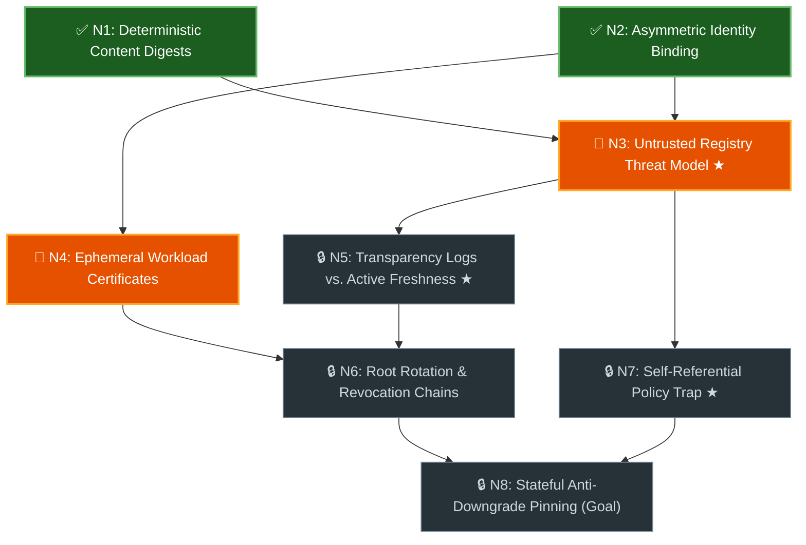

# Graph Learn (`/graph-learn`)

Use this skill to help the user build a genuine, load-bearing mental model of a
complex technical domain, specification, or codebase architecture. Skimming an
AI summary of an unfamiliar topic creates an illusion of competence; walking a
**live prerequisite graph** one unlocked layer at a time ensures every
foundational invariant clicks before dependent concepts are introduced.

## Core Graph Rules & Plain-Language Vocabulary

Keep all user-facing artifacts, Mermaid diagrams, and chat updates in clear,
self-explanatory engineering language—never leak academic set-theory or graph
jargon (such as _"Knowledge Space Theory"_, _"Hasse diagram"_, _"surmise
relation"_, _"Outer Fringe"_, or `$F^+(K)$`) to the user:

| Concept                          | Rule for the Agent                                                                                                                                                                                                              | User-Facing Term & Badge    |
| :------------------------------- | :------------------------------------------------------------------------------------------------------------------------------------------------------------------------------------------------------------------------------ | :-------------------------- |
| **Atomic Concept**               | Model each node (`N1`, `N2`, ...) as **one single load-bearing mechanism or invariant** that can be verified with a short scenario. Never merge distinct mechanisms into a muddy umbrella node just to keep the node count low. | `Concept` (`N1`, `N2`, ...) |
| **Hard Prerequisite (`A -> B`)** | Draw `A -> B` **only** when concept `B` cannot be genuinely understood or applied without `A`. Omit loose "related-to" associations.                                                                                            | `Prerequisite`              |
| **Direct Prerequisites Only**    | Never draw redundant shortcut arrows (`A -> C` when `A -> B -> C` already exists). Keep only direct prerequisite edges so the visual graph stays clean.                                                                         | _(Visual arrow in diagram)_ |
| **Mastered State**               | Concepts the user has empirically verified through a scenario check or calibration fast-forward.                                                                                                                                | `✅ Mastered` (Green)       |
| **Ready Next (Unlocked)**        | Unmastered concepts whose direct prerequisites are **all** `✅ Mastered`. These are the **only** concepts eligible for teaching and probing on the current turn (except a one-time Turn 1 diagnostic calibration check).        | `🎯 Ready Next` (Amber)     |
| **Locked State**                 | Concepts still waiting on one or more unmastered prerequisites. Never quiz or lecture on these prematurely once calibration resolves.                                                                                           | `🔒 Locked` (Slate)         |
| **Key Mental Shift**             | The 2–4 transformative ideas in the graph that permanently change how you reason about the whole system (e.g., shifting from perimeter/HTTPS trust to an untrusted-intermediary model).                                         | `★ Key Mental Shift`        |

---

## The Workflow at a Glance

Copy this checklist to track progress across the session:

- [ ] **Phase 1: Map Concepts & Run Pre-Flight Scope/Topology Gates** → Verify
      the topic forms a real prerequisite graph (`5–15` atomic concepts), gating
      with the user if `< 5` / flat or `> 15`, then save
      `<topic>_learning_graph.md` with a live color-coded Mermaid diagram.
- [ ] **Phase 2: Diagnostic Calibration** → Calibrate starting state
      (`✅ Mastered` vs. `🎯 Ready Next`) via leaf-first probes or a root-first
      walk (Execution Halted for User Input).
- [ ] **Phase 3: Ready-Next Teaching & Verification Loop** → Run iterative
      scenario checks, targeted teaching, fresh transfer questions, and live
      diagram updates on `🎯 Ready Next` concepts.
- [ ] **Phase 4: Dynamic Graph Updates (As Needed)** → Insert missing upstream
      prerequisites or split overloaded nodes when hidden gaps surface.
- [ ] **Phase 5: Mastery Closure & Practical Payoff** → Summarize key mental
      shifts and transition directly to concrete codebase or design work.

---

## Detailed Execution Phases

### Phase 1: Map Concepts & Run Pre-Flight Scope / Topology Gates

1. **Ground in Primary Sources First:** Read the relevant codebase modules,
   design documents, specifications, or reference materials before designing the
   graph. Do not invent speculative domain rules when source code or specs are
   available.
2. **Draft Atomic Concepts & Check Scope / Topology Before Proceeding:**
   Identify the atomic concepts and their direct prerequisite dependencies
   without artificially compressing or dropping topics. Before writing the full
   learning artifact, enforce two pre-flight checks:
   - **Lower-Bound & Topology Check (`< 5` Concepts or Not a Real Graph):**
     Graph learning only pays off when there are **`>= 5` atomic concepts** and
     **genuine prerequisite branching or convergence** (e.g., both `N1` and `N2`
     must click before `N3` makes sense). If the topic has `< 5` concepts, or if
     the items are a flat/independent list or a purely sequential document walk
     without hard prerequisite dependencies:
     - **Halt before creating `<topic>_learning_graph.md`**.
     - State clearly why (_"This topic only has ~3 core concepts"_ or _"These
       sections are sequential/independent rather than prerequisite-locked"_),
       and offer:
       1. **Switch to a sequential walkthrough** — recommend `/slice-and-dice`
          (`SND`) if available, or offer a clean linear section-by-section
          walkthrough.
       2. **Broaden or deepen the scope** — ask if there are upstream
          prerequisites or adjacent subsystems the user wants included to form a
          full system map.
       3. **Explain directly in chat** — clarify the 2–4 concepts concisely
          without ceremonial graph overhead.
   - **Upper-Bound Gate (`> 15` Atomic Concepts):** Never compress multiple
     distinct mechanisms into one node or silently skip important concepts just
     to stay under 15 nodes. If mapping the domain at honest atomic granularity
     yields **`> 15` concepts**:
     - **Halt before starting calibration**. Present a high-level cluster
       breakdown in chat (showing how the `N` concepts group into sub-areas) and
       prompt the user (via an interactive choice modal such as `ask_question` /
       `AskUserQuestion` if available, or numbered options in chat):
       1. `(Recommended) Start with {sub_area} first ({k} concepts)` — master
          the foundational sub-graph first before expanding into downstream
          sub-graphs.
       2. `Prune to a specific target goal` — ask what concrete task (e.g.,
          reviewing a specific PR, debugging a specific flow) the user wants to
          reach, and keep only the prerequisite chain required for that goal.
       3. `Proceed with all {n} concepts in one graph` — explicit escape hatch.
3. **Construct the Persistent Graph Document (`5–15` Concepts, Zero-Spoiler &
   Lazy Notes):** Once scope is confirmed, save `<topic>_learning_graph.md` in
   the session's artifact directory (or `/tmp/<topic>_learning_graph.md` in
   standalone CLI sessions—never create untracked files in the repository
   worktree).
   - **Keep Turn 1 Lightweight & Spoiler-Free (`<= 80` lines including the
     Mermaid diagram):** On Turn 1, populate **Part 1** with only the live
     Mermaid diagram, the full 1-row-per-node Concept Index table, and the
     active `Scenario Checks`. **Never** print `Common Misconceptions` or
     `One-Line Definition` explanations above an unmastered scenario check
     (which hands the user the answer), and **never** pre-write multi-line
     textbook sections for `🔒 Locked` concepts on Turn 1 (which wastes tokens
     if calibration fast-forwards).
   - **Record Mastery Notes Lazily in Part 2:** Append `Key Mental Shift`
     summaries, misconception notes, and code/spec mappings into **Part 2
     (Mastered Notes & Reference Appendix)** _as_ concepts are taught or
     mastered.
4. **Render the Live Color-Coded Mermaid Diagram:** Initialize the diagram with
   explicit visual state classes from Turn 1 and update it after every gate:
   - `mastered` (`✅`): Mastered.
   - `ready` (`🎯`): Ready Next (all direct prerequisites mastered). Include
     partial progress badges such as `(1/2)` when a two-part concept is half
     complete.
   - `locked` (`🔒`): Locked (waiting on upstream prerequisites).
   - Flag key mental shifts with `★` inside the node label.

#### Persistent Graph Document Template (`<topic>_learning_graph.md`)

````markdown
# Prerequisite Graph: {topic_title}

- **Progress:** 🟢 **Mastered:** `N1`, `N2` · 🟠 **Ready Next:** `N3`, `N4` · ⚪ **Locked:** `N5`–`N8`

## Part 1: Live Prerequisite Graph & Active Scenario Gates



| Node | Concept | Direct Prerequisites | Status |
| :--- | :--- | :--- | :--- |
| `N1` | Deterministic Content Digests | _(None — Root)_ | ✅ Mastered |
| `N2` | Asymmetric Identity Binding | _(None — Root)_ | ✅ Mastered |
| `N3` | Untrusted Registry Threat Model `★` | `N1`, `N2` | 🎯 Ready Next |
| `N4` | Ephemeral Workload Certificates | `N2` | 🎯 Ready Next |
| `N5` | Transparency Logs vs. Active Freshness `★` | `N3` | 🔒 Locked |
| `N6` | Root Rotation & Revocation Chains | `N4`, `N5` | 🔒 Locked |
| `N7` | Self-Referential Policy Trap `★` | `N3` | 🔒 Locked |
| `N8` | Stateful Anti-Downgrade Pinning (Goal) | `N6`, `N7` | 🔒 Locked |

### Active Gate `N3`: Untrusted Registry Threat Model `★ Key Mental Shift`
1. A client downloads `pkg-1.0.tar.gz` and verifies a valid signature over its `SHA-256` digest and source repository URL, but the signed payload omits the package name `pkg`. How can a malicious mirror exploit this without breaking the signature?
2. Why can't a client safely skip verification when `GET /packages/pkg/attestation` returns `404 Not Found` under an untrusted-registry threat model?

---

## Part 2: Mastered Notes & Reference Appendix (Populated as Concepts Unlock)

- **`N1` (Deterministic Content Digests) — Mastered:** Binds verification to canonical byte digests (`SHA-256`) rather than mutable version tags (`lib/digest.dart`).
- **`N2` (Asymmetric Identity Binding) — Mastered:** Signs structured `(subject, digest)` envelopes so verifiers authenticate both artifact and publisher (`lib/envelope.dart`).
````

---

### Phase 2: Diagnostic Calibration

Keep the Turn 1 chat response concise (`<= 25` lines): link to
`<topic>_learning_graph.md` (where the full Mermaid diagram and 1-row-per-node
Concept Index table live—do not paste a duplicate Mermaid code block into chat
when the artifact is saved), show a compact summary table (collapsing
`🔒 Locked` range rows such as `N5–N8` when needed to stay `<= 25` lines), avoid
raw LaTeX math (`$...$`) in prose, and calibrate the starting `🎯 Ready Next`
concepts:

1. **Path A — Leaf-First Calibration (Default when prior knowledge is partial or
   unknown):**
   - Initialize the Turn 1 Mermaid diagram with foundational root concepts
     marked `🎯 Ready Next` and downstream nodes `🔒 Locked`, then issue a
     **one-time diagnostic calibration probe** on 1–2 mid-tier or near-goal
     concepts using short scenario questions (1–3 sentence answers).
   - **Automatic Prerequisite Credit (Fast-Forward):** When the user passes an
     advanced scenario check, automatically mark both that concept and all of
     its upstream prerequisites `✅ Mastered` so experienced users skip
     fundamentals they already know.
   - **Walk Backward on Misses:** When a calibration probe misses (or the user
     replies `"I don't know"`), **do not teach the advanced node yet**—leave it
     `🔒 Locked`, trace backward along incoming prerequisite arrows to locate
     the earliest unmastered prerequisite (`N1`, `N2`, ...), and teach/verify
     that `🎯 Ready Next` prerequisite first.
2. **Path B — Root-First Foundation Walk (When the user is new to the topic or
   says `"Start at the roots"`):**
   - Start with 0 `✅ Mastered` nodes.
   - Mark the foundational root concepts (those with no prerequisites) as
     `🎯 Ready Next` and present only their scenario checks.

> [!IMPORTANT]
>
> **Strict Interactive Gate:** After presenting the initial calibration probes
> (or root scenario checks), stop calling tools and wait for the user's
> response. Never simulate user answers or advance through multiple layers in a
> single turn.

---

### Phase 3: The Ready-Next Teaching & Verification Loop

On each turn, focus strictly on the active **`🎯 Ready Next`** concepts:

1. **Bound Each Turn to 1–2 `🎯 Ready Next` Concepts:**
   - Never lecture on or quiz `🔒 Locked` downstream concepts whose
     prerequisites are not yet `✅ Mastered`.
   - Keep checks concise: 1–2 concrete scenario questions per concept requiring
     1–3 sentences from the user.
2. **Treat `"I Don't Know — Teach Me!"` as First-Class Signal:**
   - Encourage the user to say `"I don't know / teach me"` whenever a scenario
     hits unfamiliar territory.
   - When the user asks to be taught—or gives an answer that reveals a
     misconception—deliver a focused **Teaching Block**:
     - Address the exact conceptual gap first (e.g., _"You guessed X; the catch
       is that the verifier never queries git history at install time..."_).
     - Explain the mechanism using concrete code/protocol details paired with a
       memorable structural analogy (e.g., _"passive security camera vs. active
       door lock"_).
     - **Issue a Fresh Transfer Question (`N_x-T1`):** Never mark a concept
       `✅ Mastered` solely because you explained it, and never re-ask the exact
       question you just answered. Pose a **new scenario** testing the same
       invariant from a fresh angle to verify the mental model clicked.
3. **Track Partial Concept Progress (`(1/2)`):**
   - If a concept check has two load-bearing sub-questions (`a` and `b`) and the
     user passes `a` while missing `b`:
     - Mark `a` mastered immediately.
     - Provide a crisp micro-correction + fresh transfer question for `b` only.
     - Label the node `(1/2)` on `🎯 Ready Next` in the Mermaid diagram until
       `b` passes.
4. **Update the Live Mermaid Diagram on Every Turn:**
   - Whenever any concept advances (`🔒 -> 🎯 -> ✅` or `(1/2) -> ✅`), update
     both the Progress line and the Mermaid node classes/badges in
     `<topic>_learning_graph.md` **before** sending your chat response.
   - State the updated **`✅ Mastered`** and **`🎯 Ready Next`** concepts in a
     compact 2-line status header in chat so progress is unmistakable.

---

### Phase 4: Dynamic Graph Updates (Mid-Session Adaptation)

Treat the prerequisite graph as a living model of the domain. Update
`<topic>_learning_graph.md` and its Mermaid diagram whenever new evidence
surfaces:

- **Missing Prerequisite Discovered:** If the user struggles with concept `Nk`
  because of an unmapped foundational idea `N_new`, insert `N_new` with edge
  `N_new -> Nk`, move `Nk` back to `🔒 Locked`, and make `N_new` the active
  `🎯 Ready Next` concept.
- **Overloaded Concept Split:** If a single node bundles two independent
  mechanisms that fail separately during probing, split it into `N_ka` and
  `N_kb` with distinct prerequisite edges.
- **Curiosity Tangents:** If the user asks a sharp question about a downstream
  `🔒 Locked` concept or an implementation detail in the codebase, answer it
  concisely, note which graph node owns that invariant, and return to the active
  `🎯 Ready Next` check.

---

### Phase 5: Mastery Closure & Practical Payoff

Once every goal/leaf concept is `✅ Mastered`:

1. **Finalize the Graph Artifact:** Mark all concepts `✅ Mastered`
   (`100% Complete`) in `<topic>_learning_graph.md`.
2. **Emit a Final Summary:**
   - **Starting Baseline → All Concepts Mastered**.
   - **Load-Bearing Takeaways:** 3–5 bullet points distilling the
     `★ Key Mental Shifts` and system invariants the user now owns.
3. **Pivot to Practical Action:** Immediately offer (or transition into)
   applying the newly mastered mental model to the user's concrete goal—such as
   auditing open PR diffs against the threat model, verifying whether design doc
   claims match implementation code, or writing the target implementation.

---

## Anti-Patterns & Guardrails

- **No Academic Jargon in User Output:** Keep every Mermaid class, node label,
  and chat message strictly within the plain-language vocabulary defined in
  **Core Graph Rules & Plain-Language Vocabulary** (`Prerequisite Graph`,
  `Mastered`, `Ready Next`, `Locked`).
- **No Passive Walls of Text Before Probing:** During calibration or when a new
  `🎯 Ready Next` concept unlocks, ask the scenario check first (unless the user
  explicitly asked you to teach the concept upfront). Let the user's attempt
  reveal what they already understand.
- **No Trivia or Keyword Regurgitation:** Never ask _"What does acronym X stand
  for?"_ or _"What is the syntax of flag Y?"_. Ask causal and failure-mode
  questions (_"Why does X fail when Y happens?"_, _"What attack slips through if
  this check is omitted?"_).
- **No Self-Grading (`"Does that make sense?"`):** Never ask _"Does that make
  sense?"_ and mark a concept mastered on _"Yes"_. Always verify comprehension
  via a concrete 1–2 sentence transfer scenario.
- **Analogy Is Pedagogy, Not Proof:** Use cross-domain analogies (e.g.,
  comparing a package manager to an OS image updater) to clarify structural
  patterns, but always verify engineering conclusions against the actual source
  code or specification under review.
