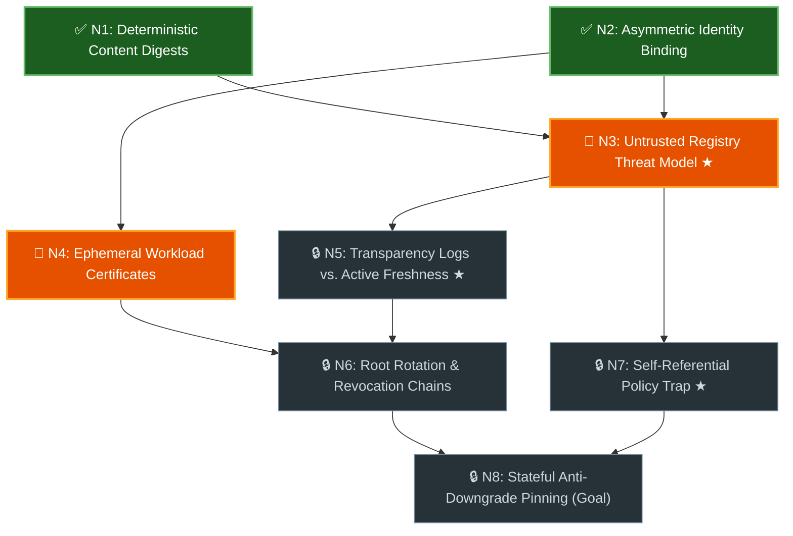

# Graph Learn (`<topic>_learning_graph.md`) Artifact & Turn Schemas

Reference templates for the persistent `<topic>_learning_graph.md` artifact,
Mermaid visual state classes, and Teaching Block + Fresh Transfer Question
(`N_x-T1`) chat turns.

## 1. Persistent Graph Document Template (`<topic>_learning_graph.md`)

````markdown
# Prerequisite Graph: {topic_title}

- **Progress:** 🟢 **Mastered:** `N1`, `N2` · 🟠 **Ready Next:** `N3`, `N4` · ⚪ **Locked:** `N5-N8`

## Part 1: Live Prerequisite Graph & Active Scenario Gates



| Node | Concept | Direct Prerequisites | Status |
| :--- | :--- | :--- | :--- |
| `N1` | Deterministic Content Digests | _(None - Root)_ | ✅ Mastered |
| `N2` | Asymmetric Identity Binding | _(None - Root)_ | ✅ Mastered |
| `N3` | Untrusted Registry Threat Model `★` | `N1`, `N2` | 🎯 Ready Next |
| `N4` | Ephemeral Workload Certificates | `N2` | 🎯 Ready Next |
| `N5` | Transparency Logs vs. Active Freshness `★` | `N3` | 🔒 Locked |
| `N6` | Root Rotation & Revocation Chains | `N4`, `N5` | 🔒 Locked |
| `N7` | Self-Referential Policy Trap `★` | `N3` | 🔒 Locked |
| `N8` | Stateful Anti-Downgrade Pinning (Goal) | `N6`, `N7` | 🔒 Locked |

### Active Gate `N3`: Untrusted Registry Threat Model `★ Key Mental Shift`
1. A client downloads `pkg-1.0.tar.gz` and verifies a valid signature over its `SHA-256` digest and source repository URL, but the signed payload omits the package name `pkg`. How can a malicious mirror exploit this without breaking the signature?
2. Why can't a client safely skip verification when `GET /packages/pkg/attestation` returns `404 Not Found` under an untrusted-registry threat model?

---

## Part 2: Mastered Notes & Reference Appendix (Populated as Concepts Unlock)

- **`N1` (Deterministic Content Digests) - Mastered:** Binds verification to canonical byte digests (`SHA-256`) rather than mutable version tags (`lib/digest.dart`).
- **`N2` (Asymmetric Identity Binding) - Mastered:** Signs structured `(subject, digest)` envelopes so verifiers authenticate both artifact and publisher (`lib/envelope.dart`).
````

## 2. Chat Turn Skeleton: Teaching Block & Fresh Transfer Question (`N_x-T1`)

```markdown
**Progress:** 🟢 **Mastered:** `N1`, `N2` · 🟠 **Ready Next:** `N3 (1/2)`, `N4` · ⚪ **Locked:** `N5-N8`

### Teaching `N3`: Untrusted Registry Threat Model ★
- **Conceptual Gap:** {Acknowledge what held up, then pinpoint the missed invariant -- e.g., git tags are never queried by the client at install time.}
- **Mechanism & Source Anchor:** {Cite concrete code/spec behavior, e.g., `lib/verifier.dart#L84`, paired with a 1-sentence structural analogy.}

### Transfer Check `N3-T1` (Unlocks `✅ Mastered` for `N3`)
{New scenario testing the same invariant from a fresh failure angle -- 1-3 sentence reply.}
```
