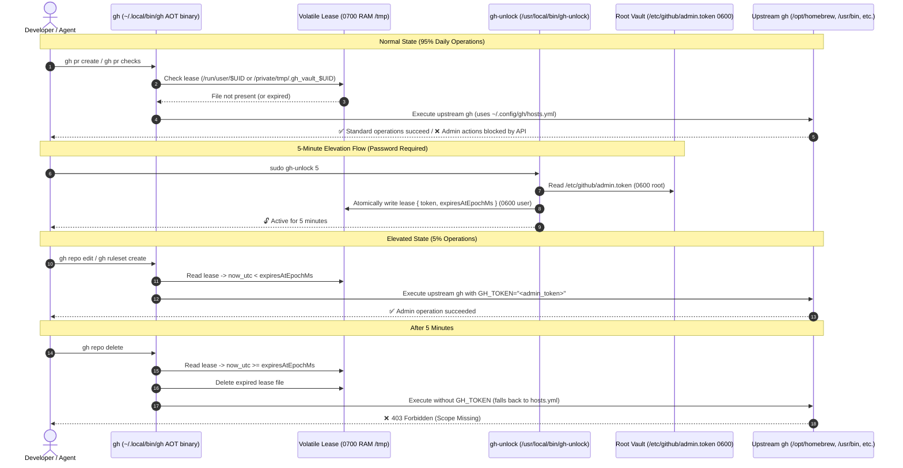

# Hardened Cross-Platform `gh_vault` Architecture & Security Specification

## 1. Executive Summary & Security Model

The `gh_vault` system provides a **zero-daemon, cross-platform security boundary** for the GitHub CLI (`gh`) across macOS (Intel & Apple Silicon), corp gLinux, and personal Linux workstations. It enforces least-privilege for daily AI agent and interactive workflows while supporting explicit, password-gated elevation via `sudo`.



---

## 2. Critical Audited Failure Modes & Hardened Solutions

<!-- mdformat off(prevent table wrapping) -->
| Risk / Vulnerability | Root Cause | Hardened Remediation |
| :--- | :--- | :--- |
| **macOS Binary Path Failure** | `/usr/bin/gh` does not exist on macOS (SIP locked). | Dynamic candidate scanner (`/opt/homebrew/bin/gh`, `/usr/local/bin/gh`, `/usr/bin/gh`, and `$PATH` crawler). |
| **`$TMPDIR` Divergence on macOS** | User shell has `TMPDIR=/var/folders/...`, but `sudo` shell has `TMPDIR=/tmp`. | Standardize on **`/private/tmp/.gh_vault_$UID`** across both user and sudo contexts. |
| **`sudo dart` Execution Failure** | User `dart` is not in root's `secure_path` in `/etc/sudoers`. JIT creates root-owned `.dart_tool`. | **AOT Compiled Binaries**: Compile `gh-unlock`, `gh`, and `gh-lock` to native binaries (`dart compile exe`). Zero runtime Dart dependencies. |
| **`chown $UID:$UID` Error** | macOS GID is `20` (`staff`), not numeric UID `501`. | Execute `chown $UID` without specifying group, allowing OS default group assignment. |
| **TOCTOU Symlink Attack in `/tmp`** | Symlink pre-creation in `/tmp` could hijack root writes. | Explicit `!FileSystemEntity.isLinkSync()` assertion and `0700` directory creation. |
| **Timezone Desynchronization** | ISO-8601 strings fail when `sudo` runs under UTC and user runs under local time. | Use **UTC Epoch Milliseconds** (`DateTime.now().toUtc().millisecondsSinceEpoch`). |
| **Static PAT Harvesting Escape** | An active agent can read the lease file while unlocked. | Recognize that `gh_vault` guards *unattended operations*. **Interactive sudo authentication** (password/TouchID) must be enforced (NO `NOPASSWD`). |
<!-- mdformat on -->

---

## 3. Package Layout in Personal Dotfiles (`~/.dotfiles`)

Tracked in `~/.dotfiles` under `~/.config/gh_vault/`:

```
~/.config/gh_vault/
├── pubspec.yaml
├── analysis_options.yaml
├── lib/
│   └── src/
│       ├── paths.dart        # Hardened path, directory, and upstream gh resolution
│       └── lease.dart        # Epoch-based serialization, verification, and atomic I/O
└── bin/
    ├── gh_dispatch.dart      # Dispatches gh commands; injects GH_TOKEN if lease valid
    ├── gh_unlock.dart        # Sudo CLI: reads vault, writes lease with duration
    └── gh_lock.dart          # User CLI: revokes active lease immediately
```

### Precompiled Native Binaries

1. `~/.local/bin/gh` (Compiled from `gh_dispatch.dart`): Shadows system `gh` on user PATH.
2. `/usr/local/bin/gh-unlock` (Compiled from `gh_unlock.dart`): Sudo-executed elevation tool.
3. `~/.local/bin/gh-lock` (Compiled from `gh_lock.dart`): Manual revocation tool.

---

## 4. Hardened Implementation Code

### `lib/src/paths.dart`
```dart
import 'dart:io';
import 'package:path/path.dart' as p;

class VaultPaths {
  static const String vaultFile = '/etc/github/admin.token';

  static Directory runtimeDir([int? targetUid]) {
    final uid = targetUid ?? currentUid();
    if (Platform.isLinux) {
      final xdg = Platform.environment['XDG_RUNTIME_DIR'];
      if (xdg != null && Directory(xdg).existsSync()) {
        final dir = Directory(p.join(xdg, 'gh_vault'));
        _ensureSecureDir(dir, uid);
        return dir;
      }
      final runUser = Directory('/run/user/$uid');
      if (runUser.existsSync()) {
        final dir = Directory(p.join(runUser.path, 'gh_vault'));
        _ensureSecureDir(dir, uid);
        return dir;
      }
    }

    // macOS & non-systemd Linux fallback
    final dir = Directory('/private/tmp/.gh_vault_$uid');
    _ensureSecureDir(dir, uid);
    return dir;
  }

  static File leaseFile([int? targetUid]) =>
      File(p.join(runtimeDir(targetUid).path, 'lease.json'));

  static int currentUid() {
    final res = Process.runSync('id', ['-u']);
    return int.parse(res.stdout.toString().trim());
  }

  static void _ensureSecureDir(Directory dir, int ownerUid) {
    if (FileSystemEntity.isLinkSync(dir.path)) {
      throw FileSystemException('Security violation: runtime dir is a symlink', dir.path);
    }
    if (!dir.existsSync()) {
      dir.createSync(recursive: true);
      Process.runSync('chmod', ['0700', dir.path]);
      if (Platform.environment['SUDO_USER'] != null) {
        Process.runSync('chown', ['$ownerUid', dir.path]);
      }
    }
  }

  static String? resolveRealGhExecutable() {
    final currentExecutable = Platform.resolvedExecutable;
    final candidates = [
      '/opt/homebrew/bin/gh',
      '/usr/local/bin/gh',
      '/usr/bin/gh',
    ];

    for (final path in candidates) {
      if (path != currentExecutable && File(path).existsSync()) {
        return path;
      }
    }

    // Dynamic PATH search fallback
    final paths = (Platform.environment['PATH'] ?? '').split(':');
    for (final dir in paths) {
      final file = File(p.join(dir, 'gh'));
      if (file.path != currentExecutable && file.existsSync()) {
        return file.path;
      }
    }
    return null;
  }
}
```

### `lib/src/lease.dart`
```dart
import 'dart:convert';
import 'dart:io';
import 'paths.dart';

class AdminLease {
  final String token;
  final int expiresAtEpochMs;

  AdminLease({required this.token, required this.expiresAtEpochMs});

  bool get isExpired =>
      DateTime.now().toUtc().millisecondsSinceEpoch >= expiresAtEpochMs;

  static AdminLease? readActive() {
    final file = VaultPaths.leaseFile();
    if (!file.existsSync()) return null;

    try {
      final content = jsonDecode(file.readAsStringSync()) as Map<String, dynamic>;
      final lease = AdminLease(
        token: content['token'] as String,
        expiresAtEpochMs: content['expiresAtEpochMs'] as int,
      );
      if (lease.isExpired) {
        file.deleteSync();
        return null;
      }
      return lease;
    } catch (_) {
      try { file.deleteSync(); } catch (_) {}
      return null;
    }
  }

  static void write({required String token, required Duration duration, int? targetUid}) {
    final file = VaultPaths.leaseFile(targetUid);
    final tmpFile = File('${file.path}.tmp');
    final expiresAt = DateTime.now().toUtc().millisecondsSinceEpoch + duration.inMilliseconds;

    final payload = jsonEncode({
      'token': token,
      'expiresAtEpochMs': expiresAt,
    });

    tmpFile.writeAsStringSync(payload, flush: true);
    Process.runSync('chmod', ['0600', tmpFile.path]);
    if (targetUid != null) {
      Process.runSync('chown', ['$targetUid', tmpFile.path]);
    }
    tmpFile.renameSync(file.path);
  }

  static bool revoke() {
    final file = VaultPaths.leaseFile();
    if (file.existsSync()) {
      file.deleteSync();
      return true;
    }
    return false;
  }
}
```

### `bin/gh_dispatch.dart`
```dart
import 'dart:io';
import 'package:gh_vault/src/lease.dart';
import 'package:gh_vault/src/paths.dart';

Future<void> main(List<String> args) async {
  final lease = AdminLease.readActive();
  final environment = Map<String, String>.from(Platform.environment);

  if (lease != null) {
    environment['GH_TOKEN'] = lease.token;
  }

  final executable = VaultPaths.resolveRealGhExecutable();
  if (executable == null) {
    stderr.writeln('❌ gh_vault: Could not find upstream gh binary in PATH.');
    exit(127);
  }

  try {
    final process = await Process.start(
      executable,
      args,
      environment: environment,
      mode: ProcessStartMode.inheritStdio,
    );
    final exitCode = await process.exitCode;
    exit(exitCode);
  } on ProcessException catch (e) {
    stderr.writeln('❌ gh_vault execution failed: ${e.message}');
    exit(127);
  }
}
```

### `bin/gh_unlock.dart`
```dart
import 'dart:io';
import 'package:args/args.dart';
import 'package:gh_vault/src/lease.dart';
import 'package:gh_vault/src/paths.dart';

void main(List<String> args) {
  final parser = ArgParser()
    ..addOption('minutes', abbr: 'm', defaultsTo: '5', help: 'Duration of admin lease in minutes.');
  final results = parser.parse(args);
  final minutes = int.tryParse(results['minutes'] as String) ?? 5;

  final vaultFile = File(VaultPaths.vaultFile);
  if (!vaultFile.existsSync()) {
    stderr.writeln('❌ Vault token not found at ${VaultPaths.vaultFile}');
    stderr.writeln('   Initialize with: sudo install -d -m 0700 /etc/github && sudo install -m 0600 /dev/null /etc/github/admin.token');
    stderr.writeln('   Then write token: sudo tee /etc/github/admin.token > /dev/null');
    exit(1);
  }

  final token = vaultFile.readAsStringSync().trim();
  final sudoUser = Platform.environment['SUDO_USER'];
  int? targetUid;
  if (sudoUser != null && sudoUser.isNotEmpty) {
    final res = Process.runSync('id', ['-u', sudoUser]);
    targetUid = int.tryParse(res.stdout.toString().trim());
  }

  AdminLease.write(
    token: token,
    duration: Duration(minutes: minutes),
    targetUid: targetUid,
  );

  final expiry = DateTime.now().add(Duration(minutes: minutes));
  final timeStr = '${expiry.hour.toString().padLeft(2, '0')}:${expiry.minute.toString().padLeft(2, '0')}:${expiry.second.toString().padLeft(2, '0')}';
  print('🔓 GitHub CLI elevated with admin privileges for $minutes minutes (expires at $timeStr).');
}
```

---

## 5. Dotfiles Installation & Compilation Flow

In `~/.dotfiles` (or `upkeep` sync script):

```bash
# 1. Compile AOT standalone binaries
dart compile exe ~/.config/gh_vault/bin/gh_dispatch.dart -o ~/.local/bin/gh
dart compile exe ~/.config/gh_vault/bin/gh_lock.dart     -o ~/.local/bin/gh-lock
dart compile exe ~/.config/gh_vault/bin/gh_unlock.dart   -o /tmp/gh-unlock

# 2. Install gh-unlock to system path
sudo install -m 0755 /tmp/gh-unlock /usr/local/bin/gh-unlock
rm -f /tmp/gh-unlock

# 3. Initialize root vault securely
sudo install -d -m 0700 /etc/github
sudo install -m 0600 /dev/null /etc/github/admin.token
printf "Enter Admin GitHub Token: "
read -s token
echo "$token" | sudo tee /etc/github/admin.token > /dev/null
```
