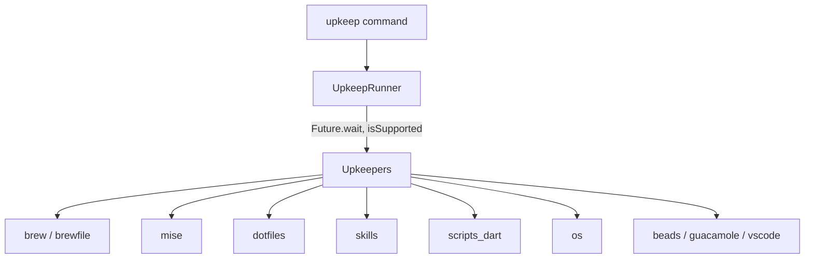

# System Upkeep (`upkeep`)

`upkeep` is a cross-platform system status checker and updater designed to run
across diverse machine environments (Mac workstation, home Linux box with
`ujust`, corp Linux box).

It provides a unified terminal interface (and an AI-agent skill wrapper) to
check the status of core dev tools in parallel and interactively apply updates.

> [!NOTE]
> This is a personal tool embedded in `personal_dotfiles`. The default set of
> upkeepers is currently **hard-coded** and wired to this author's machines
> (see [Upkeepers](#2-upkeepers)). Making it configurable and generally useful
> is tracked in the repo's issues (Stages 1–3).

---

## Install

Today `upkeep` runs from source via a small shim on `PATH`:

```bash
# ~/.local/bin/upkeep
#!/bin/bash
exec dart "$HOME/.config/upkeep/bin/upkeep.dart" "$@"
```

This requires the Dart SDK to be installed. (Shipping a `pub global activate`
install and, later, standalone native binaries are tracked as follow-up
issues.)

---

## 1. Architecture & Design Decisions

| Decision Area | Selected Approach | Key Benefit |
| :--- | :--- | :--- |
| **Language & Location** | Dart package embedded inside `personal_dotfiles` (`.config/upkeep`) | Fast execution, cross-platform, versioned directly with the dotfiles. |
| **Concurrency Model** | `Future.wait` parallel async checkers | All subsystem status checks run concurrently rather than as sequential shell calls. |
| **Interaction Model** | Interactive multi-select checkboxes (`upkeep update` with no flags) | Scans state in parallel, prints a summary table, then prompts to pick which outdated tools to upgrade. |
| **Host Profiling** | Per-adapter `isSupported()` + `Platform` checks | Each upkeeper decides at runtime whether it applies to the current host (`Platform.isMacOS`, `Platform.isLinux`, cloudtop / gLinux detection, tool detection). Adapters that don't apply are skipped (e.g. `brew`, `brewfile`, and `vscode` automatically skip on cloudtop). |
| **Agent Skill Integration** | CLI + `upkeep check --json` + agent skill wrapper | LLMs can invoke `upkeep check --json` to inspect state non-destructively, or run `upkeep update --yes` unattended. |

---

## 2. Upkeepers

Registered in `lib/src/runner.dart` (`UpkeepRunner`). Each is gated by
`isSupported()`, so only the ones relevant to the current host run.



| ID | Purpose |
| :--- | :--- |
| `brew` | Homebrew packages — audits installed vs. expected, runs `brew upgrade` / `brew cleanup` (automatically skipped on cloudtop). |
| `brewfile` | Reconciles `~/.config/brew/Brewfile.shared` + `Brewfile.mac` / `Brewfile.linux` (automatically skipped on cloudtop). |
| `mise` | Checks `mise outdated --json`; runs `mise upgrade`. |
| `dotfiles` | `git fetch` on the `personal_dotfiles` repo; reports/pulls when behind. |
| `skills` | Runs `npx skills check`; on update, runs `npx skills update -g` + local sync and reconciles skill symlinks. |
| `scripts_dart` | Checks/activates `scripts.dart` from GitHub (`dart pub global activate --source git …`). |
| `os` | OS updates — e.g. `ujust update` on home Linux (`ostree`); on gLinux/cloudtop checks `gcertstatus`, `/var/run/reboot-required`, and `apt list --upgradable` (`~0.76s`), updating via `sudo apt-get upgrade -y`; no-op on macOS. |
| `beads` | `beads` / Dolt-backed issue store upkeep (`bd` / `dolt`). On cloudtop, dynamically bypasses Homebrew checks and installs/upgrades directly via `go install`. |
| `guacamole` | Apache Guacamole (personal Linux host). |
| `vscode` | VS Code extension and settings symlink updates (automatically skipped on cloudtop). |

> Several upkeepers (`scripts_dart`, `guacamole`, `beads`, `os`, `skills`,
> `vscode`) are specific to this author's setup. `isSupported()` dynamically hides them on
> hosts where they don't apply (for example, `brew`, `brewfile`, and `vscode` skip when
> running on cloudtop/gLinux, while `beads` adapts to use `go install` directly).

---

## 3. CLI

`upkeep` uses a subcommand interface (`package:args` `CommandRunner`).

| Command | Description |
| :--- | :--- |
| `upkeep check` | Non-destructive status scan; renders a status table. |
| `upkeep update` | Checks status, then applies updates (interactive by default). |
| `upkeep triage` | Interactive Brewfile package management. |
| `upkeep list` | Lists registered upkeepers and host-support status. |
| `upkeep --version` | Prints the version. |

**`check` flags:** `--json` (machine-readable output), `-i`/`--interactive`,
`-k`/`--keeper <id,…>`, plus positional IDs.
**`update` flags:** `-y`/`--yes` (apply all outdated non-interactively),
`-k`/`--keeper <id,…>`, `--verbose`, `--cleanup` (Brewfile), plus positional IDs.

```bash
upkeep check                 # status table for all supported upkeepers
upkeep check --json          # machine-readable status (for agents)
upkeep check brew mise       # only these; also: upkeep check -k brew,mise
upkeep update                # interactive multi-select of outdated items
upkeep update --yes          # update everything outdated, no prompts
upkeep update brew           # update a specific upkeeper
upkeep list                  # registered upkeepers + support status
```

### `upkeep check --json` sample

```json
{
  "version": "0.1.0",
  "hostname": "kevmoo-mac",
  "platform": "macos",
  "upkeepers": [
    { "id": "brew", "displayName": "Homebrew Packages & Environment", "state": "outdated", "summary": "14 outdated, 7 missing from Brewfile" },
    { "id": "mise", "displayName": "Mise Tool Versions", "state": "outdated", "summary": "3 tool version(s) outdated" },
    { "id": "dotfiles", "displayName": "Personal Dotfiles Repository", "state": "upToDate", "summary": "Dotfiles repository is up to date" },
    { "id": "skills", "displayName": "Agent Skills", "state": "upToDate", "summary": "Agent skills up to date" },
    { "id": "scripts_dart", "displayName": "Scripts.dart Package (GitHub)", "state": "outdated", "summary": "Click update to sync latest GitHub HEAD" }
  ]
}
```

---

## 4. Project Directory Structure

```
.config/upkeep/
├── README.md
├── pubspec.yaml
├── analysis_options.yaml
├── bin/
│   └── upkeep.dart
├── lib/
│   ├── upkeep.dart
│   └── src/
│       ├── models.dart
│       ├── runner.dart
│       ├── commands/
│       │   ├── commands.dart
│       │   ├── check_command.dart
│       │   ├── update_command.dart
│       │   ├── triage_command.dart
│       │   └── list_command.dart
│       ├── ui/
│       │   ├── table_formatter.dart
│       │   └── interactive_select.dart
│       └── upkeepers/
│           ├── upkeeper.dart
│           ├── upkeepers.dart
│           ├── brew_upkeeper.dart
│           ├── brewfile_upkeeper.dart
│           ├── mise_upkeeper.dart
│           ├── dotfiles_upkeeper.dart
│           ├── skills_upkeeper.dart
│           ├── scripts_dart_upkeeper.dart
│           ├── os_upkeeper.dart
│           ├── beads_dolt_upkeeper.dart
│           ├── guacamole_upkeeper.dart
│           └── vscode_upkeeper.dart
└── test/
    └── upkeep_test.dart
```
