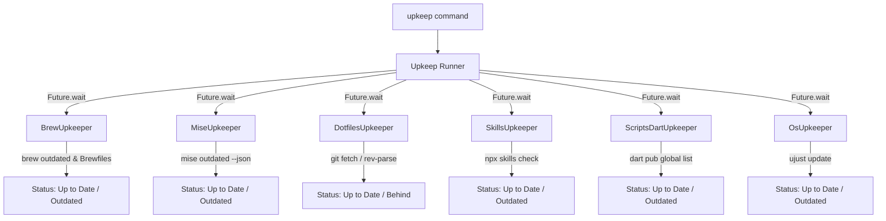

# System Upkeep (`upkeep`)

`upkeep` is a cross-platform system status checker and updater designed to run across diverse machine environments (Mac workstation, Home Linux box with `ujust`, Corp Linux box).

It provides a unified terminal interface and an AI Agent Skill wrapper to rapidly check the status of core dev tools in parallel and interactively apply updates.

---

## 1. Architecture & Design Decisions

| Decision Area | Selected Approach | Key Benefit |
| :--- | :--- | :--- |
| **Language & Location** | Dart package embedded inside `personal_dotfiles` (`.config/upkeep`) | Fast execution, cross-platform, versioned directly with dotfiles, rich ecosystem for terminal UI. |
| **Concurrency Model** | `Future.wait` parallel async checkers | All 6+ subsystem status checks complete in ~1 second rather than sequential shell delay. |
| **Interaction Model** | Interactive Multi-Select Checkboxes in terminal | Scans state in parallel, displays a summary table, then presents checkboxes to pick which outdated tools to upgrade. |
| **Self-Update Protocol** | Atomic AOT Binary Replacement (`upkeep.tmp` -> `upkeep`) | Compiles new binary, verifies health via `--version`, then atomically swaps target binary without breaking running session. |
| **Machine Profiling** | Auto-detection + `~/.config/upkeep/config.yaml` overrides | Built-in platform adapters (`Platform.isMacOS`, `Platform.isLinux`, `ujust` detection) plus custom shell command overrides. |
| **Agent Skill Integration** | Dual interface: CLI + `--json` mode + Agent Skill wrapper | LLMs can invoke `upkeep --json` to inspect state non-destructively or run unattended updates (`upkeep --yes`). |

---

## 2. Core Subsystem Upkeepers



### Subsystem Details:
1. **`BrewUpkeeper`**: Absorbs and consolidates existing `brew-check` and `brewall` shell scripts into native Dart logic:
   - Reads `~/.config/brew/Brewfile.shared` + `Brewfile.mac` / `Brewfile.linux`.
   - Audits installed vs expected formulae/casks (detects missing & unmanaged items).
   - Runs `brew bundle --upgrade --cleanup --force` + `brew upgrade` + `brew cleanup`.
2. **`MiseUpkeeper`**: Checks `mise outdated --json`. Runs `mise upgrade` on selection.
3. **`DotfilesUpkeeper`**: Performs background `git fetch` in `personal_dotfiles`. If behind, pulls changes and triggers self-update AOT compilation step.
4. **`SkillsUpkeeper`**: Runs `npx skills check`. Runs `npx skills update -g` (global skills) + local dotfiles skills sync on selection.
5. **`ScriptsDartUpkeeper`**: Checks git updates for `scripts.dart`. Always activates from GitHub (`dart pub global activate --source git https://github.com/kevmoo/scripts.dart.git`) — never local path.
6. **`OsUpkeeper`**:
   - **macOS**: Skipped / no-op (macOS native system notifications handle OS updates).
   - **Home Linux**: Checks/runs `ujust update`.
   - **Corp Linux**: Checks/runs corp-specific package updater scripts.

---

## 3. Self-Update & Atomic Compilation Hand-Over

When `DotfilesUpkeeper` detects changes to `tools/upkeep` (or `.config/upkeep`):
```
[upkeep] Dotfiles updated! Compiling new version of upkeep...
1. Executing: dart compile exe bin/upkeep.dart -o ~/.local/bin/upkeep.tmp
2. Verification: ~/.local/bin/upkeep.tmp --version
3. Atomic swap: mv ~/.local/bin/upkeep.tmp ~/.local/bin/upkeep
4. Result: Successfully upgraded upkeep executable.
```
If compilation fails, `~/.local/bin/upkeep.tmp` is deleted, the existing executable is retained, and a clear error report is displayed.

---

## 4. CLI Execution & Agent Skill Interfaces

### Terminal CLI Commands
- `upkeep`: Scans all tools in parallel, renders status table, prompts with interactive multi-select checkbox menu.
- `upkeep --check` (`-c`): Non-destructive status scan only (displays tabular overview).
- `upkeep --yes` (`-y`): Non-interactive mode (updates all outdated items automatically).
- `upkeep --json`: Emits machine-readable JSON status report for agent parsing.
- `upkeep --verbose`: Shows detailed subprocess stdout/stderr during updates.

### JSON Schema Output Sample (`upkeep --json`)
```json
{
  "version": "0.1.0",
  "hostname": "kevmoo-mac",
  "platform": "macos",
  "upkeepers": [
    { "id": "brew", "displayName": "Homebrew Packages & Environment", "state": "outdated", "summary": "14 outdated, 7 missing from Brewfile" },
    { "id": "mise", "displayName": "Mise Tool Versions", "state": "outdated", "summary": "3 tool version(s) outdated" },
    { "id": "dotfiles", "displayName": "Personal Dotfiles Repository", "state": "upToDate", "summary": "Dotfiles repository is up to date" },
    { "id": "skills", "displayName": "Agent Skills", "state": "upToDate", "summary": "Agent skills up to date" },
    { "id": "scripts_dart", "displayName": "Scripts.dart Package (GitHub)", "state": "outdated", "summary": "Activated globally (click update to sync latest GitHub HEAD)" }
  ]
}
```

---

## 5. Project Directory Structure

```
.config/upkeep/
├── README.md
├── pubspec.yaml
├── analysis_options.yaml
├── bin/
│   └── upkeep.dart
├── lib/
│   ├── upkeep.dart
│   └── src/
│       ├── models.dart
│       ├── runner.dart
│       ├── ui/
│       │   ├── table_formatter.dart
│       │   └── interactive_select.dart
│       └── upkeepers/
│           ├── upkeeper.dart
│           ├── upkeepers.dart
│           ├── brew_upkeeper.dart
│           ├── mise_upkeeper.dart
│           ├── dotfiles_upkeeper.dart
│           ├── skills_upkeeper.dart
│           ├── scripts_dart_upkeeper.dart
│           └── os_upkeeper.dart
└── test/
    └── upkeep_test.dart
```
